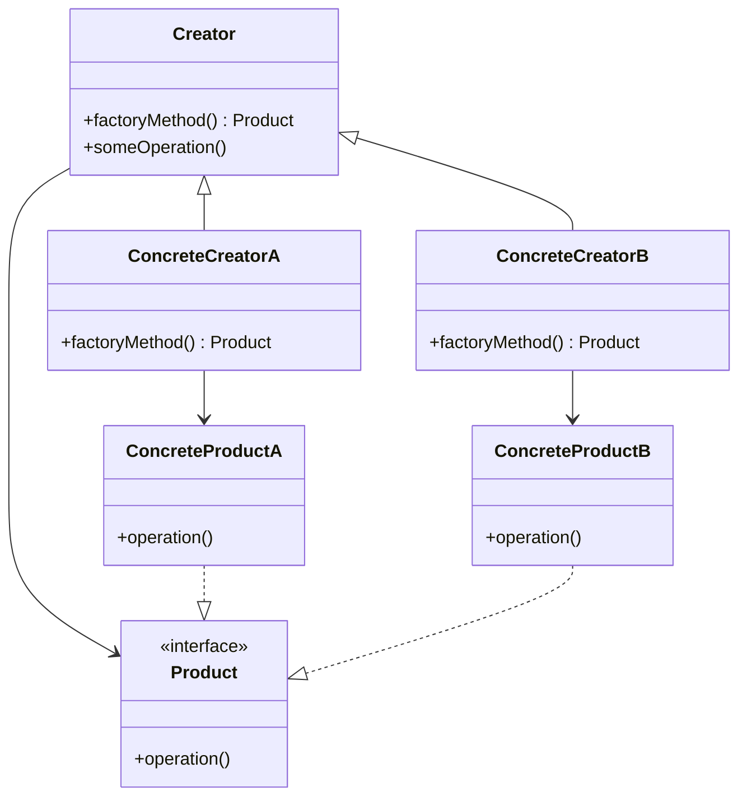
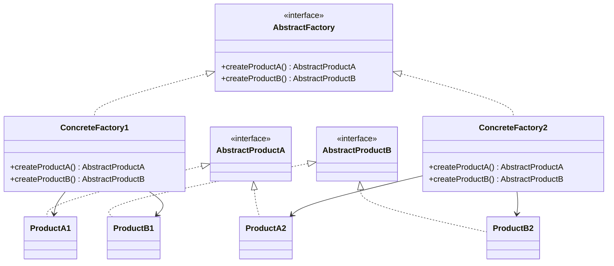
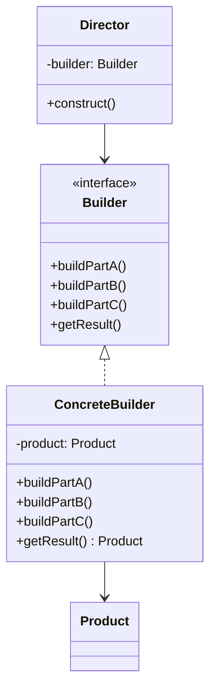

# Design Patterns: Comprehensive Guide

## 1. Factory Method Pattern

### Overview
The Factory Method pattern defines an interface for creating objects, but lets subclasses decide which class to instantiate.

### Deep Understanding

#### Intent
- Define an interface for creating an object, but let subclasses decide which class to instantiate
- Let a class defer instantiation to subclasses
- Promote loose coupling by eliminating the need to bind application-specific classes into the code

#### Structure


#### Implementation
```java
// Product interface
interface Document {
    void open();
    void save();
    void close();
}

// Concrete Products
class PdfDocument implements Document {
    public void open() { System.out.println("Opening PDF document"); }
    public void save() { System.out.println("Saving PDF document"); }
    public void close() { System.out.println("Closing PDF document"); }
}

class WordDocument implements Document {
    public void open() { System.out.println("Opening Word document"); }
    public void save() { System.out.println("Saving Word document"); }
    public void close() { System.out.println("Closing Word document"); }
}

// Creator
abstract class DocumentCreator {
    // Factory Method
    public abstract Document createDocument();
    
    // Template method using factory method
    public void newDocument() {
        Document doc = createDocument();
        doc.open();
        // Additional operations...
    }
}

// Concrete Creators
class PdfDocumentCreator extends DocumentCreator {
    public Document createDocument() {
        return new PdfDocument();
    }
}

class WordDocumentCreator extends DocumentCreator {
    public Document createDocument() {
        return new WordDocument();
    }
}
```

#### When to Use
- When a class can't anticipate the class of objects it must create
- When a class wants its subclasses to specify the objects it creates
- When you want to provide a library of classes and only reveal their interfaces, not implementations

## 2. Abstract Factory Pattern

### Overview
Abstract Factory provides an interface for creating families of related or dependent objects without specifying their concrete classes.

### Deep Understanding

#### Intent
- Provide an interface for creating families of related or dependent objects without specifying their concrete classes
- Support multiple families of products
- Ensure that created objects are compatible with each other

#### Structure


#### Implementation
```java
// Abstract Products
interface Button {
    void render();
    void onClick();
}

interface Checkbox {
    void render();
    boolean isChecked();
}

// Concrete Products for Windows
class WindowsButton implements Button {
    public void render() { System.out.println("Rendering Windows button"); }
    public void onClick() { System.out.println("Windows button clicked"); }
}

class WindowsCheckbox implements Checkbox {
    private boolean checked;
    public void render() { 
        System.out.println("Rendering Windows checkbox: " + (checked ? "✓" : "☐"));
    }
    public boolean isChecked() { return checked; }
    public void setChecked(boolean checked) { this.checked = checked; }
}

// Concrete Products for Mac
class MacButton implements Button {
    public void render() { System.out.println("Rendering Mac button"); }
    public void onClick() { System.out.println("Mac button clicked"); }
}

class MacCheckbox implements Checkbox {
    private boolean checked;
    public void render() { 
        System.out.println("Rendering Mac checkbox: " + (checked ? "✓" : "☐"));
    }
    public boolean isChecked() { return checked; }
    public void setChecked(boolean checked) { this.checked = checked; }
}

// Abstract Factory
interface GUIFactory {
    Button createButton();
    Checkbox createCheckbox();
}

// Concrete Factories
class WindowsFactory implements GUIFactory {
    public Button createButton() { return new WindowsButton(); }
    public Checkbox createCheckbox() { return new WindowsCheckbox(); }
}

class MacFactory implements GUIFactory {
    public Button createButton() { return new MacButton(); }
    public Checkbox createCheckbox() { return new MacCheckbox(); }
}

// Client
class Application {
    private Button button;
    private Checkbox checkbox;
    
    public Application(GUIFactory factory) {
        button = factory.createButton();
        checkbox = factory.createCheckbox();
    }
    
    public void render() {
        button.render();
        checkbox.render();
    }
}
```

#### When to Use
- When the system needs to be independent of how its products are created, composed, and represented
- When the system needs to be configured with multiple families of products
- When you want to provide a class library of products, and you want to reveal just their interfaces, not their implementations

## 3. Factory Method vs Abstract Factory

| Aspect | Factory Method | Abstract Factory |
|--------|----------------|------------------|
| **Purpose** | Creates single objects through inheritance | Creates families of related objects through composition |
| **Implementation** | Subclasses decide object creation | Object creation is delegated to factory objects |
| **Flexibility** | Less flexible - bound to specific creator hierarchy | More flexible - can easily add new product families |
| **Complexity** | Simpler to implement | More complex due to multiple factories and products |
| **Use Case** | When you need to create one type of object with variations | When you need to create families of related objects |
| **Dependency** | Creator depends on concrete products | Client depends only on abstract interfaces |

## 4. Builder Pattern

### Overview
Builder pattern separates the construction of a complex object from its representation, allowing the same construction process to create different representations.

### Deep Understanding

#### Intent
- Separate the construction of a complex object from its representation
- Allow the same construction process to create different representations
- Provide control over the construction process

#### Structure


#### Implementation
```java
// Product
class Computer {
    private String CPU;
    private String RAM;
    private String storage;
    private String graphicsCard;
    
    // Private constructor to force use of builder
    private Computer(ComputerBuilder builder) {
        this.CPU = builder.CPU;
        this.RAM = builder.RAM;
        this.storage = builder.storage;
        this.graphicsCard = builder.graphicsCard;
    }
    
    // Static builder class
    public static class ComputerBuilder {
        private String CPU;
        private String RAM;
        private String storage;
        private String graphicsCard;
        
        public ComputerBuilder setCPU(String CPU) {
            this.CPU = CPU;
            return this;
        }
        
        public ComputerBuilder setRAM(String RAM) {
            this.RAM = RAM;
            return this;
        }
        
        public ComputerBuilder setStorage(String storage) {
            this.storage = storage;
            return this;
        }
        
        public ComputerBuilder setGraphicsCard(String graphicsCard) {
            this.graphicsCard = graphicsCard;
            return this;
        }
        
        public Computer build() {
            // Validation can be added here
            if (CPU == null || RAM == null) {
                throw new IllegalStateException("CPU and RAM are required");
            }
            return new Computer(this);
        }
    }
    
    // Getters
    public String getCPU() { return CPU; }
    public String getRAM() { return RAM; }
    public String getStorage() { return storage; }
    public String getGraphicsCard() { return graphicsCard; }
}

// Usage
public class BuilderDemo {
    public static void main(String[] args) {
        Computer gamingPC = new Computer.ComputerBuilder()
            .setCPU("Intel i9")
            .setRAM("32GB")
            .setStorage("1TB SSD")
            .setGraphicsCard("RTX 3080")
            .build();
    }
}
```

## 5. Fluent Interface

### Overview
Fluent Interface is a method for designing object-oriented APIs that provides more readable code through method chaining.

### Implementation
```java
// Fluent Builder with Director
class SQLQueryBuilder {
    private StringBuilder query = new StringBuilder();
    
    public SQLQueryBuilder select(String... columns) {
        query.append("SELECT ");
        if (columns.length == 0) {
            query.append("*");
        } else {
            query.append(String.join(", ", columns));
        }
        return this;
    }
    
    public SQLQueryBuilder from(String table) {
        query.append(" FROM ").append(table);
        return this;
    }
    
    public SQLQueryBuilder where(String condition) {
        query.append(" WHERE ").append(condition);
        return this;
    }
    
    public SQLQueryBuilder orderBy(String column) {
        query.append(" ORDER BY ").append(column);
        return this;
    }
    
    public String build() {
        return query.toString();
    }
}

// Usage
public class FluentDemo {
    public static void main(String[] args) {
        String query = new SQLQueryBuilder()
            .select("id", "name", "email")
            .from("users")
            .where("age > 18")
            .orderBy("name")
            .build();
        
        System.out.println(query);
        // Output: SELECT id, name, email FROM users WHERE age > 18 ORDER BY name
    }
}
```

## 6. Builder vs Fluent Interface

| Aspect | Builder Pattern | Fluent Interface |
|--------|----------------|------------------|
| **Primary Purpose** | Construct complex objects step by step | Improve code readability through method chaining |
| **Implementation** | Separate Builder class with build() method | Method chaining with return this |
| **Complexity** | More structured, often with Director | Simpler, just method chaining |
| **Validation** | Can validate at build() time | Validation happens during method calls |
| **Use Case** | When object construction is complex | When you want readable API for configuration |

## 7. Strategy Pattern

### Overview
Strategy pattern defines a family of algorithms, encapsulates each one, and makes them interchangeable.

### Deep Understanding

#### Intent
- Define a family of algorithms, encapsulate each one, and make them interchangeable
- Let the algorithm vary independently from clients that use it
- Replace inheritance with composition for behavior

#### Implementation
```java
// Strategy interface
interface PaymentStrategy {
    void pay(int amount);
}

// Concrete Strategies
class CreditCardPayment implements PaymentStrategy {
    private String name;
    private String cardNumber;
    private String cvv;
    
    public CreditCardPayment(String name, String cardNumber, String cvv) {
        this.name = name;
        this.cardNumber = cardNumber;
        this.cvv = cvv;
    }
    
    public void pay(int amount) {
        System.out.println(amount + " paid with credit card: " + cardNumber);
    }
}

class PayPalPayment implements PaymentStrategy {
    private String email;
    
    public PayPalPayment(String email) {
        this.email = email;
    }
    
    public void pay(int amount) {
        System.out.println(amount + " paid using PayPal: " + email);
    }
}

class CryptoPayment implements PaymentStrategy {
    private String walletAddress;
    
    public CryptoPayment(String walletAddress) {
        this.walletAddress = walletAddress;
    }
    
    public void pay(int amount) {
        System.out.println(amount + " paid with cryptocurrency: " + walletAddress);
    }
}

// Context
class ShoppingCart {
    private List<String> items = new ArrayList<>();
    private PaymentStrategy paymentStrategy;
    
    public void addItem(String item) {
        items.add(item);
    }
    
    public void setPaymentStrategy(PaymentStrategy strategy) {
        this.paymentStrategy = strategy;
    }
    
    public void checkout(int total) {
        if (paymentStrategy == null) {
            throw new IllegalStateException("Payment strategy not set");
        }
        paymentStrategy.pay(total);
        items.clear();
    }
}

// Usage
public class StrategyDemo {
    public static void main(String[] args) {
        ShoppingCart cart = new ShoppingCart();
        cart.addItem("Laptop");
        cart.addItem("Mouse");
        
        // Strategy can be changed at runtime
        cart.setPaymentStrategy(new CreditCardPayment("John Doe", "1234-5678", "123"));
        cart.checkout(1500);
        
        cart.setPaymentStrategy(new PayPalPayment("john@example.com"));
        cart.checkout(200);
    }
}
```

## 8. Template Method Pattern

### Overview
Template Method defines the skeleton of an algorithm in a method, deferring some steps to subclasses.

### Implementation
```java
// Abstract class with template method
abstract class DataProcessor {
    // Template method - defines the algorithm skeleton
    public final void process() {
        readData();
        processData();
        writeData();
        if (hook()) {
            additionalProcessing();
        }
    }
    
    // Concrete steps
    private void readData() {
        System.out.println("Reading data from source...");
    }
    
    private void writeData() {
        System.out.println("Writing processed data...");
    }
    
    // Abstract step - must be implemented by subclasses
    protected abstract void processData();
    
    // Hook method - optional override
    protected boolean hook() {
        return false;
    }
    
    protected void additionalProcessing() {
        // Default implementation (can be empty)
    }
}

// Concrete implementations
class CSVDataProcessor extends DataProcessor {
    protected void processData() {
        System.out.println("Processing CSV data: parsing, validating, transforming");
    }
}

class XMLDataProcessor extends DataProcessor {
    protected void processData() {
        System.out.println("Processing XML data: parsing, validating, transforming");
    }
    
    // Override hook method
    protected boolean hook() {
        return true;
    }
    
    protected void additionalProcessing() {
        System.out.println("Performing XML-specific additional processing");
    }
}

// Usage
public class TemplateMethodDemo {
    public static void main(String[] args) {
        DataProcessor csvProcessor = new CSVDataProcessor();
        csvProcessor.process();
        
        System.out.println("\n---\n");
        
        DataProcessor xmlProcessor = new XMLDataProcessor();
        xmlProcessor.process();
    }
}
```

## 9. Strategy vs Template Method

| Aspect | Strategy Pattern | Template Method Pattern |
|--------|------------------|-------------------------|
| **Relationship** | Composition-based (has-a) | Inheritance-based (is-a) |
| **Flexibility** | More flexible - algorithms can be changed at runtime | Less flexible - algorithm structure is fixed |
| **Algorithm Control** | Complete algorithm can be replaced | Only specific steps can be overridden |
| **Complexity** | More classes and objects | Fewer classes but tighter coupling |
| **Use Case** | When you need different variants of entire algorithm | When you have algorithm with invariant parts |

## 10. Observer Pattern

### Overview
Observer pattern defines a one-to-many dependency between objects so that when one object changes state, all its dependents are notified.

### Implementation
```java
import java.util.*;

// Subject interface
interface Subject {
    void registerObserver(Observer observer);
    void removeObserver(Observer observer);
    void notifyObservers();
}

// Concrete Subject
class WeatherStation implements Subject {
    private List<Observer> observers = new ArrayList<>();
    private float temperature;
    private float humidity;
    private float pressure;
    
    public void setMeasurements(float temperature, float humidity, float pressure) {
        this.temperature = temperature;
        this.humidity = humidity;
        this.pressure = pressure;
        measurementsChanged();
    }
    
    private void measurementsChanged() {
        notifyObservers();
    }
    
    public void registerObserver(Observer observer) {
        observers.add(observer);
    }
    
    public void removeObserver(Observer observer) {
        observers.remove(observer);
    }
    
    public void notifyObservers() {
        for (Observer observer : observers) {
            observer.update(temperature, humidity, pressure);
        }
    }
    
    // Other weather station methods...
}

// Observer interface
interface Observer {
    void update(float temperature, float humidity, float pressure);
}

// Concrete Observers
class CurrentConditionsDisplay implements Observer {
    private float temperature;
    private float humidity;
    
    public void update(float temperature, float humidity, float pressure) {
        this.temperature = temperature;
        this.humidity = humidity;
        display();
    }
    
    public void display() {
        System.out.println("Current conditions: " + temperature + "°C and " + humidity + "% humidity");
    }
}

class StatisticsDisplay implements Observer {
    private List<Float> temperatures = new ArrayList<>();
    private float maxTemp = 0.0f;
    private float minTemp = 200.0f;
    private float tempSum = 0.0f;
    private int numReadings;
    
    public void update(float temperature, float humidity, float pressure) {
        tempSum += temperature;
        numReadings++;
        
        if (temperature > maxTemp) {
            maxTemp = temperature;
        }
        
        if (temperature < minTemp) {
            minTemp = temperature;
        }
        
        temperatures.add(temperature);
        display();
    }
    
    public void display() {
        System.out.println("Avg/Max/Min temperature = " + (tempSum / numReadings) + "/" + maxTemp + "/" + minTemp);
    }
}

// Usage
public class ObserverDemo {
    public static void main(String[] args) {
        WeatherStation weatherStation = new WeatherStation();
        
        CurrentConditionsDisplay currentDisplay = new CurrentConditionsDisplay();
        StatisticsDisplay statisticsDisplay = new StatisticsDisplay();
        
        weatherStation.registerObserver(currentDisplay);
        weatherStation.registerObserver(statisticsDisplay);
        
        // Simulate weather changes
        weatherStation.setMeasurements(25, 65, 1013);
        weatherStation.setMeasurements(27, 70, 1012);
        weatherStation.setMeasurements(23, 90, 1014);
    }
}
```

## 11. Publisher-Subscriber Pattern

### Overview
Pub-Sub is a messaging pattern where senders (publishers) don't program messages to be sent directly to specific receivers (subscribers).

### Implementation
```java
import java.util.*;

// Message class
class Message {
    private String topic;
    private String content;
    
    public Message(String topic, String content) {
        this.topic = topic;
        this.content = content;
    }
    
    public String getTopic() { return topic; }
    public String getContent() { return content; }
}

// Subscriber interface
interface Subscriber {
    void receiveMessage(Message message);
}

// Publisher interface
interface Publisher {
    void publish(String topic, String message);
    void subscribe(String topic, Subscriber subscriber);
    void unsubscribe(String topic, Subscriber subscriber);
}

// Message Broker (Mediator)
class MessageBroker implements Publisher {
    private Map<String, List<Subscriber>> topicSubscribers = new HashMap<>();
    
    public void subscribe(String topic, Subscriber subscriber) {
        topicSubscribers.computeIfAbsent(topic, k -> new ArrayList<>()).add(subscriber);
    }
    
    public void unsubscribe(String topic, Subscriber subscriber) {
        List<Subscriber> subscribers = topicSubscribers.get(topic);
        if (subscribers != null) {
            subscribers.remove(subscriber);
        }
    }
    
    public void publish(String topic, String content) {
        Message message = new Message(topic, content);
        List<Subscriber> subscribers = topicSubscribers.get(topic);
        if (subscribers != null) {
            for (Subscriber subscriber : subscribers) {
                subscriber.receiveMessage(message);
            }
        }
    }
}

// Concrete Subscribers
class EmailService implements Subscriber {
    public void receiveMessage(Message message) {
        if ("user.registered".equals(message.getTopic())) {
            System.out.println("Sending welcome email: " + message.getContent());
        }
    }
}

class SMSService implements Subscriber {
    public void receiveMessage(Message message) {
        if ("order.placed".equals(message.getTopic())) {
            System.out.println("Sending SMS notification: " + message.getContent());
        }
    }
}

class AnalyticsService implements Subscriber {
    public void receiveMessage(Message message) {
        System.out.println("Logging analytics for topic " + message.getTopic() + ": " + message.getContent());
    }
}

// Usage
public class PubSubDemo {
    public static void main(String[] args) {
        MessageBroker broker = new MessageBroker();
        
        EmailService emailService = new EmailService();
        SMSService smsService = new SMSService();
        AnalyticsService analyticsService = new AnalyticsService();
        
        // Subscriptions
        broker.subscribe("user.registered", emailService);
        broker.subscribe("order.placed", smsService);
        broker.subscribe("user.registered", analyticsService);
        broker.subscribe("order.placed", analyticsService);
        
        // Publishing messages
        broker.publish("user.registered", "User John Doe registered successfully");
        broker.publish("order.placed", "Order #12345 placed for $150");
    }
}
```

## 12. Observer vs Publisher-Subscriber

| Aspect | Observer Pattern | Publisher-Subscriber Pattern |
|--------|------------------|------------------------------|
| **Coupling** | Tight coupling - observers know subject | Loose coupling - publishers/subscribers don't know each other |
| **Communication** | Direct notification | Through message broker/channel |
| **Relationship** | One-to-many within application | Many-to-many, can be distributed |
| **Complexity** | Simpler implementation | More complex with message routing |
| **Use Case** | GUI components, model-view separation | Event-driven systems, microservices |

## 13. Decorator Pattern

### Overview
Decorator pattern allows behavior to be added to individual objects, dynamically, without affecting the behavior of other objects from the same class.

### Implementation
```java
// Component interface
interface Coffee {
    String getDescription();
    double getCost();
}

// Concrete Component
class SimpleCoffee implements Coffee {
    public String getDescription() {
        return "Simple Coffee";
    }
    
    public double getCost() {
        return 2.0;
    }
}

// Decorator abstract class
abstract class CoffeeDecorator implements Coffee {
    protected Coffee decoratedCoffee;
    
    public CoffeeDecorator(Coffee coffee) {
        this.decoratedCoffee = coffee;
    }
    
    public String getDescription() {
        return decoratedCoffee.getDescription();
    }
    
    public double getCost() {
        return decoratedCoffee.getCost();
    }
}

// Concrete Decorators
class MilkDecorator extends CoffeeDecorator {
    public MilkDecorator(Coffee coffee) {
        super(coffee);
    }
    
    public String getDescription() {
        return decoratedCoffee.getDescription() + ", Milk";
    }
    
    public double getCost() {
        return decoratedCoffee.getCost() + 0.5;
    }
}

class SugarDecorator extends CoffeeDecorator {
    public SugarDecorator(Coffee coffee) {
        super(coffee);
    }
    
    public String getDescription() {
        return decoratedCoffee.getDescription() + ", Sugar";
    }
    
    public double getCost() {
        return decoratedCoffee.getCost() + 0.2;
    }
}

class WhippedCreamDecorator extends CoffeeDecorator {
    public WhippedCreamDecorator(Coffee coffee) {
        super(coffee);
    }
    
    public String getDescription() {
        return decoratedCoffee.getDescription() + ", Whipped Cream";
    }
    
    public double getCost() {
        return decoratedCoffee.getCost() + 0.7;
    }
}

// Usage
public class DecoratorDemo {
    public static void main(String[] args) {
        // Simple coffee
        Coffee coffee = new SimpleCoffee();
        System.out.println(coffee.getDescription() + " = $" + coffee.getCost());
        
        // Coffee with milk and sugar
        Coffee coffeeWithMilkAndSugar = new SugarDecorator(new MilkDecorator(new SimpleCoffee()));
        System.out.println(coffeeWithMilkAndSugar.getDescription() + " = $" + coffeeWithMilkAndSugar.getCost());
        
        // Fancy coffee with everything
        Coffee fancyCoffee = new WhippedCreamDecorator(
            new SugarDecorator(
                new MilkDecorator(
                    new SimpleCoffee()
                )
            )
        );
        System.out.println(fancyCoffee.getDescription() + " = $" + fancyCoffee.getCost());
    }
}
```

## 14. Composite Pattern

### Overview
Composite pattern composes objects into tree structures to represent part-whole hierarchies, letting clients treat individual objects and compositions uniformly.

### Implementation
```java
import java.util.*;

// Component interface
interface FileSystemComponent {
    void showDetails();
    long getSize();
}

// Leaf class
class File implements FileSystemComponent {
    private String name;
    private long size;
    
    public File(String name, long size) {
        this.name = name;
        this.size = size;
    }
    
    public void showDetails() {
        System.out.println("File: " + name + " (" + size + " bytes)");
    }
    
    public long getSize() {
        return size;
    }
}

// Composite class
class Directory implements FileSystemComponent {
    private String name;
    private List<FileSystemComponent> components = new ArrayList<>();
    
    public Directory(String name) {
        this.name = name;
    }
    
    public void addComponent(FileSystemComponent component) {
        components.add(component);
    }
    
    public void removeComponent(FileSystemComponent component) {
        components.remove(component);
    }
    
    public void showDetails() {
        System.out.println("Directory: " + name + " (Total size: " + getSize() + " bytes)");
        for (FileSystemComponent component : components) {
            component.showDetails();
        }
    }
    
    public long getSize() {
        long totalSize = 0;
        for (FileSystemComponent component : components) {
            totalSize += component.getSize();
        }
        return totalSize;
    }
}

// Usage
public class CompositeDemo {
    public static void main(String[] args) {
        // Create files
        File file1 = new File("document.txt", 1024);
        File file2 = new File("image.jpg", 2048);
        File file3 = new File("video.mp4", 4096);
        File file4 = new File("readme.txt", 512);
        
        // Create directories
        Directory documents = new Directory("Documents");
        Directory pictures = new Directory("Pictures");
        Directory videos = new Directory("Videos");
        Directory root = new Directory("Root");
        
        // Build tree structure
        documents.addComponent(file1);
        documents.addComponent(file4);
        pictures.addComponent(file2);
        videos.addComponent(file3);
        
        root.addComponent(documents);
        root.addComponent(pictures);
        root.addComponent(videos);
        
        // Show details - client treats individual and composite objects uniformly
        root.showDetails();
        
        System.out.println("\n--- Individual component details ---");
        file1.showDetails();
        documents.showDetails();
    }
}
```

## 15. Decorator vs Composite

| Aspect | Decorator Pattern | Composite Pattern |
|--------|-------------------|-------------------|
| **Purpose** | Add responsibilities to objects | Compose objects into tree structures |
| **Structure** | Wrapper around single object | Tree structure with leaf and composite nodes |
| **Relationship** | One-to-one decoration | One-to-many composition |
| **Transparency** | Decorator and component have same interface | Leaf and composite have same interface |
| **Use Case** | Adding features dynamically | Representing part-whole hierarchies |

---

# Probable Questions and Answers

## Factory Method Questions

**Q1: When would you choose Factory Method over Simple Factory?**
**A:** Factory Method is preferred when:
- You need to delegate object creation to subclasses
- You want to provide extension points for future customization
- You're building a framework that needs to be extended by clients
- Simple Factory is sufficient for simple cases but lacks flexibility for complex hierarchies

**Q2: Can Factory Method work with dependency injection?**
**A:** Yes, Factory Method can be combined with DI containers. The factory can be injected as a dependency, and the DI container can provide the appropriate concrete factory based on configuration.

```java
@Component
class PaymentProcessor {
    private final PaymentFactory paymentFactory;
    
    @Autowired
    public PaymentProcessor(PaymentFactory paymentFactory) {
        this.paymentFactory = paymentFactory;
    }
    
    public void processPayment(String type, double amount) {
        Payment payment = paymentFactory.createPayment(type);
        payment.process(amount);
    }
}
```

## Abstract Factory Questions

**Q1: How does Abstract Factory ensure product compatibility?**
**A:** Abstract Factory ensures compatibility by:
- Providing a consistent interface for creating related products
- Each concrete factory produces products that are designed to work together
- Clients work with abstract interfaces, not concrete implementations

**Q2: What's the main disadvantage of Abstract Factory?**
**A:** The main disadvantage is complexity. Adding new product families requires modifying the abstract factory interface and all concrete implementations, which violates the Open/Closed Principle.

## Builder Pattern Questions

**Q1: When is Builder pattern better than telescoping constructors?**
**A:** Builder is better when:
- Object has many optional parameters
- You want immutable objects after construction
- You need validation during construction
- You want clear, readable object creation code

**Q2: How do you handle mandatory fields in Builder pattern?**
**A:** You can handle mandatory fields by:
- Making them constructor parameters in the builder
- Validating in the build() method
- Using method names that indicate requirement

```java
public class UserBuilder {
    private final String username; // Mandatory
    private final String email;    // Mandatory
    private String firstName;      // Optional
    private String lastName;       // Optional
    
    public UserBuilder(String username, String email) {
        this.username = username;
        this.email = email;
    }
    
    // Optional fields with setter methods...
}
```

## Strategy Pattern Questions

**Q1: How does Strategy pattern help with testing?**
**A:** Strategy pattern improves testability by:
- Allowing easy mocking of strategies
- Enabling isolated unit testing of each strategy
- Making it easy to test different algorithm combinations

**Q2: Can Strategy pattern be used to replace if-else chains?**
**A:** Yes, Strategy pattern is excellent for replacing complex conditional logic. Instead of large if-else or switch statements, you can use a map of strategies:

```java
class PaymentStrategyFactory {
    private Map<String, PaymentStrategy> strategies = new HashMap<>();
    
    public PaymentStrategyFactory() {
        strategies.put("creditcard", new CreditCardStrategy());
        strategies.put("paypal", new PayPalStrategy());
        strategies.put("crypto", new CryptoStrategy());
    }
    
    public PaymentStrategy getStrategy(String type) {
        return strategies.get(type);
    }
}
```

## Template Method Questions

**Q1: What's the difference between abstract methods and hook methods?**
**A:** 
- **Abstract methods**: Must be implemented by subclasses (compiler enforced)
- **Hook methods**: Optional methods that subclasses can override to add behavior

**Q2: When should you use Template Method vs Strategy?**
**A:** Use Template Method when:
- You have an algorithm with invariant steps
- Subclasses need to customize specific steps
- You want to avoid code duplication

Use Strategy when:
- You need to switch between complete algorithms at runtime
- Algorithms are substantially different
- You want to avoid deep inheritance hierarchies

## Observer Pattern Questions

**Q1: How do you prevent infinite loops in Observer pattern?**
**A:** To prevent infinite loops:
- Avoid notifying observers from within update methods
- Use change flags to detect circular notifications
- Implement careful state management

**Q2: What are the memory leak risks in Observer pattern?**
**A:** Memory leaks can occur if:
- Subjects hold strong references to observers
- Observers are not properly unregistered
- Use WeakReference or ensure proper cleanup

## Decorator Pattern Questions

**Q1: How is Decorator different from inheritance?**
**A:** Decorator provides:
- Runtime composition vs compile-time inheritance
- Multiple decorators can be combined
- More flexible than static inheritance

**Q2: Can decorators change the interface of the component?**
**A:** No, decorators must implement the same interface as the component. They can add behavior but not change the fundamental interface.

## Composite Pattern Questions

**Q1: How do you handle operations that don't make sense for leaves?**
**A:** You can:
- Throw UnsupportedOperationException for invalid operations
- Provide default implementations in the component interface
- Use the null object pattern

**Q1: What's the challenge with type safety in Composite?**
**A:** The challenge is that clients might try to perform composite-specific operations on leaf nodes. You need to handle this through careful design or runtime checks.

---

# Tricky Parts and Common Pitfalls

## 1. Factory Method vs Abstract Factory Confusion
**Pitfall**: Using Abstract Factory when you only need to create one type of object.
**Solution**: Use Factory Method for single product hierarchies, Abstract Factory for product families.

## 2. Builder Pattern Validation
**Pitfall**: Forgetting to validate mandatory fields in build() method.
**Solution**: Always validate in build() and throw meaningful exceptions.

## 3. Strategy Pattern Runtime Switching
**Pitfall**: Not considering thread safety when switching strategies at runtime.
**Solution**: Use proper synchronization or immutable strategy objects.

## 4. Observer Pattern Performance
**Pitfall**: Notifying all observers when only some are interested in specific changes.
**Solution**: Implement filtered notifications or use Pub-Sub with topics.

## 5. Decorator Pattern Order Dependency
**Pitfall**: Decorators that depend on being applied in specific order.
**Solution**: Design decorators to be order-independent or document ordering requirements.

## 6. Composite Pattern Child Management
**Pitfall**: Allowing operations like addChild() on leaf nodes.
**Solution**: Use the null object pattern or explicit type checking with clear error messages.

This comprehensive guide covers the essential patterns with detailed implementations, comparisons, and practical considerations for effective usage in real-world applications.
